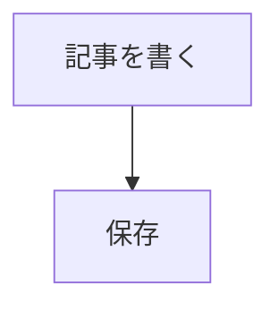

# Agent 引き続き仕様

作成日: 2026-05-26  
対象プロジェクト: `familyai.jp`  
作業ディレクトリ: `/mnt/c/Users/jun.li/OneDrive-UiPath/CC/Familyai.jp`

## 目的

このドキュメントは、別 Agent が本プロジェクトの作業を引き継ぐための全体設計書です。コードベースの主要構造、記事管理・Markdown 表示・DB・API・最近の変更点・既知の注意点をまとめています。

## 技術スタック

- Framework: Next.js 14 App Router
- Language: TypeScript / React 18
- DB: PostgreSQL on Neon
- ORM: Drizzle ORM / drizzle-kit
- Auth: NextAuth v5 beta
- Styling: Tailwind CSS + `app/globals.css` + inline style が混在
- Markdown: `react-markdown`, `remark-gfm`, `rehype-raw`, `rehype-sanitize`, `rehype-highlight`
- Diagram: `mermaid`
- Package manager: `pnpm@9.15.0`

## 主要ディレクトリ

```text
app/
  (site)/                 公開サイト
  (site)/learn/           記事一覧・記事詳細
  admin/                  管理画面
  api/                    Route Handlers

components/
  article/                記事本文、カード、AI Chat、Markdown 拡張
  admin/                  管理画面 UI
  learn/                  記事一覧フィルター UI
  layout/                 Header/Footer など
  tools/, voaenglish/     学習ツール系 UI

lib/
  db/                     Drizzle schema / DB client
  repositories/           DB access 集約層
  schemas/                Zod validation
  mappers/                DB row -> shared DTO
  articles/               記事本文補助ロジック
  api/                    API guard

shared/
  types/                  Web/API/iOS 共通 DTO
  constants/              カテゴリ、難易度、サイト定数
  api/                    shared API client
  utils/                  共通 utility

content/articles/         Markdown 記事の元データ候補
res/scripts/              Markdown -> DB 同期スクリプト実体
drizzle/                  migration SQL
```

## ルーティング概要

### 公開サイト

- `/`
  - トップページ
- `/learn`
  - 記事一覧
  - `cat`, `tag`, `level`, `sort`, `search`, `page` に対応
- `/learn/[slug]`
  - 記事詳細
  - 右 sidebar に TOC と AI Chat
- `/tools`
  - 各種学習ツール入口
- `/tools/voaenglish/...`
  - VOA English 教材
- `/tools/ai-kyoshitsu/...`
  - AI 教室系ページ

### 管理画面

- `/admin`
  - 記事一覧
  - 分類・タグ・タイトル検索・ソート・ページング
  - Markdown export
- `/admin/articles/new`
  - 記事新規作成
- `/admin/articles/[slug]/edit`
  - 記事編集
- `/admin/3d-models`
  - 3D モデル管理
- `/admin/ai-config`
  - AI Chat 設定
- `/admin/users`
  - ユーザー管理

### API

- `/api/articles`
  - 公開記事一覧
- `/api/articles/[slug]`
  - 公開記事詳細
- `/api/articles/latest`
  - 最新記事
- `/api/articles/[slug]/related`
  - 関連記事
- `/api/admin/articles`
  - 管理記事一覧 / 作成
- `/api/admin/articles/[slug]`
  - 管理記事更新 / 削除
- `/api/admin/articles/[slug]/toggle`
  - 公開状態切替
- `/api/link-preview`
  - URL link card 用 OGP 取得 API
- `/api/ai`
  - 記事 AI Chat など

## DB 設計の中心

DB schema は `lib/db/schema.ts` にあります。

### articles

主なカラム:

- `id`
- `slug`
- `title`
- `description`
- `body`
- `categories text[]`
- `tags text[]`
- `level`
- `thumbnailUrl`
- `viewCount`
- `isFeatured`
- `published`
- `publishedAt`
- `createdAt`
- `updatedAt`

最近追加された重要変更:

- `tags text[] NOT NULL DEFAULT ARRAY[]::text[]`
- `articles_tags_gin_idx`

該当 migration:

- `drizzle/0021_article_tags.sql`

注意:

- 本番 DB で `tags` カラム未適用の状態だと、記事一覧が空になります。
- 2026-05-26 時点で本番 DB には手動で `tags` カラムと GIN index を適用済みです。
- migration journal が古い状態の可能性があります。drizzle migration 周りを触る場合は `drizzle/meta/_journal.json` を必ず確認してください。

## 記事データの流れ

### 表示時

Web 表示は DB の `articles` テーブルが正です。

```text
DB articles
  -> lib/repositories/articles.ts
  -> lib/mappers/articles.ts
  -> app/(site)/learn/page.tsx
  -> app/(site)/learn/[slug]/page.tsx
  -> components/article/*
```

### 管理画面保存時

```text
AdminArticleForm
  -> /api/admin/articles or /api/admin/articles/[slug]
  -> createArticleSchema / updateArticleSchema
  -> lib/repositories/articles.ts
  -> DB articles
```

### Markdown ファイル同期

`content/articles/*.md` は記事元データとして使えますが、Web 表示時に直接読まれません。DB へ同期して初めて公開画面に反映されます。

同期スクリプト実体:

- `res/scripts/sync-articles.ts`

重要な既知ズレ:

- `package.json` の `db:sync` は現在 `tsx scripts/sync-articles.ts` を指しています。
- しかし実体は `res/scripts/sync-articles.ts` にあります。
- 同期を使う前に、`package.json` を次のように直すか、直接実行してください。

```json
"db:sync": "tsx res/scripts/sync-articles.ts"
```

同期スクリプトの注意:

- `content/articles/*.md` を upsert します。
- `content/articles/` に存在しない slug は DB から削除します。
- DB 管理画面だけで作成した記事を保持したい場合、この削除挙動に注意してください。

## 記事 Markdown 表示

中心ファイル:

- `components/article/ArticleBody.tsx`

現在対応している表示:

- GitHub Flavored Markdown
- テーブル
- コードブロック + copy button
- syntax highlight
- iframe/audio の限定埋め込み
- YouTube embed 正規化
- 単語注釈 `{word|meaning|pron|example}`
- 記事 TOC 用 H1/H2 id 付与
- 単独行 URL の link preview card
- Mermaid diagram
- Zenn 風 message block

### 単独 URL link card

Markdown:

```md
https://google.com
```

処理:

- `ArticleBody.tsx` が単独 URL 段落を検出
- `components/article/LinkPreviewCard.tsx` に差し替え
- `/api/link-preview?url=...` から OGP 情報取得

API 安全対策:

- `localhost`
- private IP
- `.local`
- unsafe redirect

を拒否します。

### Mermaid

Markdown:

````md

````

処理:

- `ArticleBody.tsx` が `language-mermaid` を検出
- `components/article/MermaidDiagram.tsx` が client side で `mermaid` を dynamic import
- SVG として表示

### Zenn 風メッセージ

Markdown:

```md
:::message
通常メッセージ
:::
```

```md
:::message alert
警告メッセージ
:::
```

注意:

- コードブロック内の `:::` は無視します。
- 閉じ忘れた message block は通常 Markdown として fallback します。

### Table of Contents

関連ファイル:

- `lib/articles/toc.ts`
- `components/article/ArticleTableOfContents.tsx`
- `app/(site)/learn/[slug]/page.tsx`
- `components/article/ArticleBody.tsx`

仕様:

- Markdown 本文から `# H1` と `## H2` を抽出
- コードブロック内の heading は無視
- 重複見出しは `-2`, `-3` を付与
- 記事詳細 sidebar の AI Chat 上に表示
- `<details>` でデフォルト折りたたみ

## 記事一覧のタグ・分類機能

### 公開 `/learn`

関連:

- `app/(site)/learn/page.tsx`
- `components/learn/TagFilter.tsx`
- `components/home/CategoryFilter.tsx`
- `lib/repositories/articles.ts`

仕様:

- `cat=education,work`
- `tag=ChatGPT,画像生成`
- 複数タグは OR 条件
- タグ候補は公開記事に存在する tags から取得

### 管理 `/admin`

関連:

- `components/admin/AdminArticleTable.tsx`
- `app/api/admin/articles/route.ts`
- `lib/schemas/articles.ts`
- `lib/repositories/articles.ts`

仕様:

- 分類列を表示
- タグ列を表示
- 分類 select で絞り込み
- タグ入力で絞り込み
- タイトル検索と併用可能
- 管理 API は `category` / `tag` query を受け取ります。

## 管理画面 Markdown export

関連:

- `components/admin/AdminArticleTable.tsx`

仕様:

- 行チェックボックスで記事を選択
- header checkbox で表示中記事を一括選択
- `MDエクスポート（n）` ボタンで `{slug}.md` として download
- frontmatter:
  - `title`
  - `description`
  - `categories`
  - `tags`
  - `level`
  - `published`
  - `publishedAt`

## Admin Article Form

関連:

- `components/admin/ArticleForm.tsx`
- `lib/schemas/articles.ts`

仕様:

- タグはカンマ区切りで自由入力
- 最大 20 個
- 1 タグ最大 32 文字
- 重複と空白は保存前に normalize

## AI Chat

関連:

- `components/article/AIChatWidget.tsx`
- `app/api/ai/route.ts`
- `lib/ai/*`
- `lib/config/ai-config.ts`
- `app/admin/ai-config/*`

設定は DB / env / default の多層構成です。詳細変更前に `lib/config/ai-config.ts` と `shared/constants/index.ts` の `AI_CHAT_DEFAULTS` を確認してください。

## 3D / VOA 系

3D:

- `lib/repositories/3d-models.ts`
- `components/tools/3d-tutor/*`
- `app/admin/3d-models/*`

VOA English:

- `content/voaenglish/*`
- `lib/voaenglish/*`
- `components/voaenglish/*`
- `app/(site)/tools/voaenglish/*`

これらは記事機能とは別ドメインですが、同じ DB/auth/shared UI の影響を受けます。

## 認証・管理ガード

関連:

- `lib/auth.ts`
- `lib/admin-auth.ts`
- `lib/api/admin-guard.ts`
- `app/api/auth/[...nextauth]/route.ts`

管理 API は `protectAdminRoute` を使う方針です。新規 admin API を追加する場合は既存 route の guard pattern に合わせてください。

## 重要コマンド

通常は Windows 側 Node が安定しています。WSL 側で `pnpm` を直接実行すると Windows shim を拾って `node: not found` になることがあります。

推奨:

```bash
npx tsc --noEmit
npm run build
```

Windows cmd 経由の例:

```bash
"/mnt/c/Windows/System32/cmd.exe" /c "cd /d C:\Users\jun.li\OneDrive-UiPath\CC\Familyai.jp && npm run dev"
```

開発サーバー:

- `npm run dev`
- 3000 使用中の場合は Next.js が 3001 などへ退避します。

DB:

```bash
pnpm db:migrate
pnpm db:generate
pnpm db:push
```

ただしこの環境では PowerShell / cmd 経由で実行した方が安定する場合があります。

## build / test の注意

直近確認済み:

- `npx tsc --noEmit` 成功
- `npm run build` 成功

ただし `npm run build` 中に以下の既存ログが出ることがあります。

- admin page の build-time DB access
- `tutor3d_models` query
- Neon `DYNAMIC_SERVER_USAGE`
- `articles.listAllArticles` の DB query log

これらは今回の Markdown / tag / TOC 追加由来ではなく、既存の build 時 DB access 由来です。終了コード 0 なら build は成功扱いです。

## Git / 作業ツリーの注意

このリポジトリは広範囲に既存の未コミット変更がある状態で作業されていました。別 Agent は以下を守ってください。

- 無関係な変更を revert しない。
- `git reset --hard` を使わない。
- コミットする場合は対象ファイルを明示して `git add` する。
- `git status --short -- <対象ファイル>` で自分の変更だけ確認する。

直近コミット例:

```text
089c977 記事本文の Markdown 表示で Zenn 独自記法のメッセージブロックに対応しました。
c83a0ea 記事本文の Markdown 表示を拡張し、URL カード表示・Mermaid 図表示・読みやすい preview スタイルを追加しました。
c122684 管理画面の記事一覧を分類・タグで探しやすくしました。
948afac fix: align article tag filter beside search
63c78d0 add free-form article tags and filtering
```

## 最近追加された主要機能

1. 記事 free-form tags
   - DB `articles.tags`
   - Admin form
   - `/learn?tag=...`
   - 管理一覧タグ列・タグ検索

2. 管理記事 Markdown export
   - 選択記事を `.md` として download

3. 記事 TOC
   - H1/H2 抽出
   - AI Chat 上に折りたたみ表示

4. Markdown 表示拡張
   - URL link card
   - Mermaid
   - Zenn message / alert
   - Obsidian preview 寄りの list/code spacing

## 次の Agent に推奨する確認手順

1. まず作業対象ファイルだけの status を確認

```bash
git status --short -- <files>
```

2. 型チェック

```bash
npx tsc --noEmit
```

3. 必要に応じて build

```bash
npm run build
```

4. 記事表示を確認する場合

```bash
npm run dev
```

確認 URL:

- `http://localhost:3000/learn`
- `http://localhost:3000/learn/english-learning-voice-ai`
- `http://localhost:3000/admin`

未ログインの場合 `/auth/signin` に redirect されます。

## 触る時の判断基準

- 記事表示の変更はまず `ArticleBody.tsx` を確認する。
- 記事データ取得の変更は `lib/repositories/articles.ts` を確認する。
- DTO 契約変更は `shared/types/index.ts` と `lib/mappers/articles.ts` を同時に見る。
- 管理 API 追加は `lib/api/admin-guard.ts` の guard pattern に合わせる。
- DB schema 変更は `lib/db/schema.ts` と `drizzle/` migration を必ずセットで扱う。
- 公開一覧と管理一覧は似ているが別実装。公開は `/learn`、管理は `/admin`。

## 未解決・注意すべき課題

- `package.json` の `db:sync` が実体とズレています。
  - 現在: `tsx scripts/sync-articles.ts`
  - 実体: `res/scripts/sync-articles.ts`
- Drizzle migration journal が古い可能性があります。
- Markdown link-preview API は簡易 HTML parser です。より厳密な OGP 取得が必要なら parser 導入を検討してください。
- Link preview は外部サイト fetch を行うため、timeout / cache / SSRF 対策を維持してください。
- Mermaid は client dynamic import です。bundle size や初回描画遅延が気になる場合は lazy loading の UX を調整してください。
